# PickHome

Self-hosted apartment scoring for house hunting: weighted criteria, dealbreakers, team ratings, viewing checklists, comparison, map, calendar, purchase-cost estimates, commute times, subsidies, price history, optional LLM assist, and on-site sun AR. German UI, no payment integration.

Repository: [github.com/n3roGit/PickHome](https://github.com/n3roGit/PickHome)

I would greatly appreciate support for my project. Every $ contributes to enhancing the project.

<a href="https://www.paypal.com/cgi-bin/webscr?cmd=_s-xclick&hosted_button_id=6ZFSVPZWLLAMC">
  
</a>

## Features

### Scoring and collaboration

- **Projects** with budget, shared **team** (multiple users per search)
- **Criteria** in groups: weight 1–5, optional **dealbreaker**, ratings 0–10 per person
- **Leaderboard** with live scores, dealbreaker highlighting, configurable dealbreaker threshold
- **Partner divergence**: side-by-side ratings when team members disagree notably
- **Archive** with reasons, notes, and rejection-pattern stats on the archived tab
- **Duplicate detection** for similar titles/addresses within a project

### Viewing checklist

- **Project checklist** tab: enable criteria for on-site notes, custom extra points, team assignee
- **Per-apartment checklist** (`/apartment/.../checklist`): three-state slider (not ok / unset / ok), notes, camera shortcut for photos
- Filled checklist hints appear on **rating sliders** on the apartment page
- **Broker questions** per criterion group (Makler-Fragen), independent of enabled checklist points

### Per apartment

- **Toolbar** with live score summary; criteria section collapsed by default
- **Basics**: price, size (m²), **plot size** (m²), floor, year built, energy class, broker involvement, listing URL
- **Running costs**: HOA, heating, property tax, renovation, cold rent (monthly/annual fields)
- **Listing import**: paste an expose URL to pre-fill empty fields when creating an apartment
- **Auto-fill** from uploaded exposé PDF (optional LLM extraction when configured)
- **Photos** (up to 10 MB) and **PDF documents** / exposé (up to 30 MB); full-text search includes document text; camera capture shortcut
- **Ratings** with optional notes; live score summary while editing
- **Viewing appointments** (past/upcoming) on the apartment page and project calendar; **60-minute slots**, driving-time buffer between addresses, overlap warnings
- **Purchase costs** (rough estimate): land transfer tax by Bundesland — from apartment address when detectable, else project default — plus notary/registry and buyer broker
- **Financing** (rough estimate): equity, loan term, interest rate, monthly payment and lifetime cost from project settings
- **Price history** when listing price changes (import or manual)
- **Commute** times and distances to each team member’s saved addresses (driving / cycling / walking via OSRM; **public transit** via [transport.rest](https://v6.db.transport.rest) with fallbacks to [v5.db.api.bahn.guru](https://v5.db.api.bahn.guru) and GTFS/MOTIS ([GTFS Deutschland](https://gtfs.de) via `TRANSIT_GTFS_API_BASE`); optional `TRANSIT_API_BASES` and self-hosted `OSRM_BASE_URL`)
- **Company car** benefit estimates on commute legs when configured in account settings
- **Subsidy hints** (rough match against common programs from apartment/project data)
- **BORIS** land-value lookup when coordinates are available
- **Standort & Umfeld** (with coordinates): OSM POIs nearby (Overpass), EU noise maps (UBA), river flood risk zones (BfG/LAWA) — orientation only, cached 90 days
- **Desired area** badge when the address matches the project’s Wunschgebiet filter
- **PDF export** of apartment summary (scores, basics, commute, checklist, …)
- **Sun path & AR on site** (`/apartment/.../sonne-ar`): camera + compass + GPS for sun markers (HTTPS or localhost)
- **LLM chat** on the apartment (optional; admin API key): context from listing, notes, documents; optional web search (Tavily/Brave)

### Project tabs

| Tab | Highlights |
|-----|------------|
| **Immobilien** | Sortable list, **full-text search** across fields/ratings/viewings/media, score legend, listing import |
| **Archiv** | Archived apartments, archive-reason breakdown |
| **Team** | Invite/remove project members |
| **Einstellungen** | Name, budget, Bundesland, broker rate, financing defaults, dealbreaker threshold, **Wunschgebiet** (Ort + PLZ/districts), **background reindex** for PDF full-text search and commute routes (status polling while you keep using the app) |
| **Kriterien** | Edit criterion groups, weights, dealbreakers, broker questions |
| **Checkliste** | Enable/disable checklist points, assignees, custom points |
| **Vergleich** | Compare up to 5 apartments: scores, criteria, purchase/finance metrics, partner divergence |
| **Karte** | Pins colored by score; **Wunschgebiet** PLZ circles (toggle); dealbreaker styling |
| **Kalender** | All viewings; **iCal feed** URL for Google Calendar, Outlook, Apple Calendar |

### Account (`/account/settings`)

- Change password
- **TOTP two-factor authentication** with recovery codes
- **Commute addresses** (home, workplace, …) and travel mode (driving, cycling, walking, **public transit** with arrival time and short-trip OSRM fallback)
- **Company car** settings for commute benefit estimates

### Admin (`/admin`)

- Create users, reset passwords, delete users (cannot delete last admin)
- **Backup**: download/upload full ZIP (database + uploads)
- **Scheduled backups**: daily job, retention, restore from stored ZIPs in `data/`
- **LLM**: base URL, API key, model, system prompt; optional web-search keys (Tavily/Brave)
- App timezone and related settings

## Screenshots

Screenshots use **demo data only** — no production or personal house-hunt data. **Addresses** are public OSM places (Berlin, Hamburg, München, Bremen) from `tests/helpers/synthetic-addresses.ts`, so map, geocoding, commute, and Wunschgebiet work. Names (*Alex Demo*, *Sam Demo*) and listing URLs (`example.com`) are fictional. To reproduce locally:

```bash
npm run db:push && npm run db:seed
npx tsx scripts/seed-readme-demo.ts
npm run dev
```

Log in as `demo` / `demo`, open project *Demo-Suchprojekt*.

### Project & overview

| Dashboard | Apartment list |
|-----------|----------------|
| 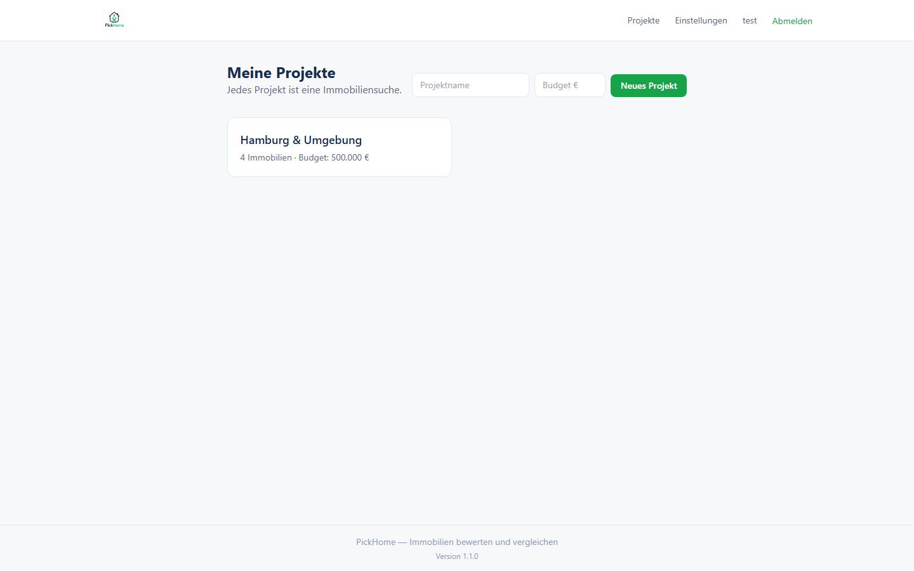 | 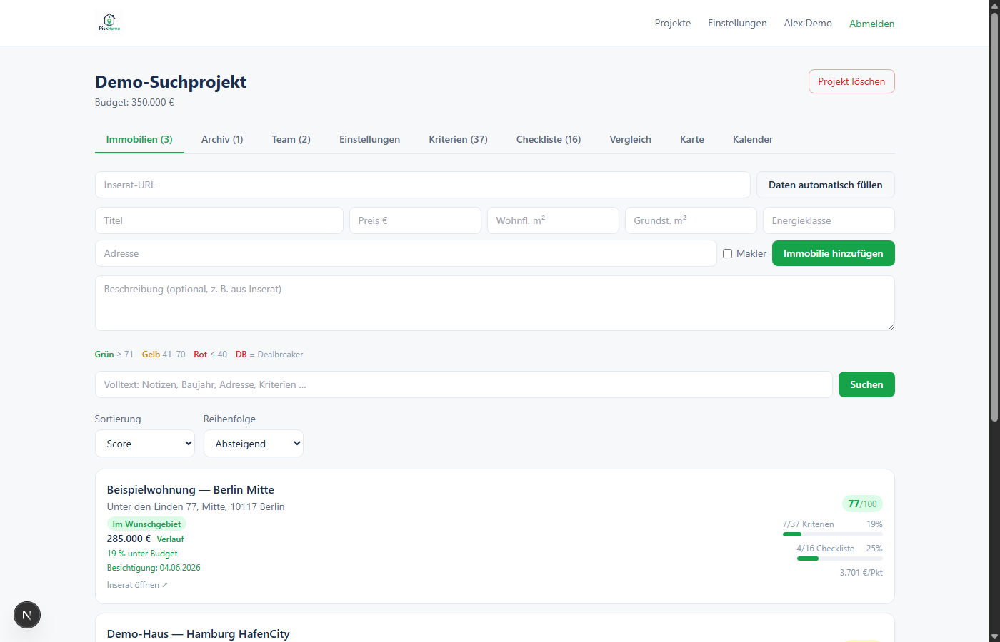 |

| Compare | Map |
|---------|-----|
| 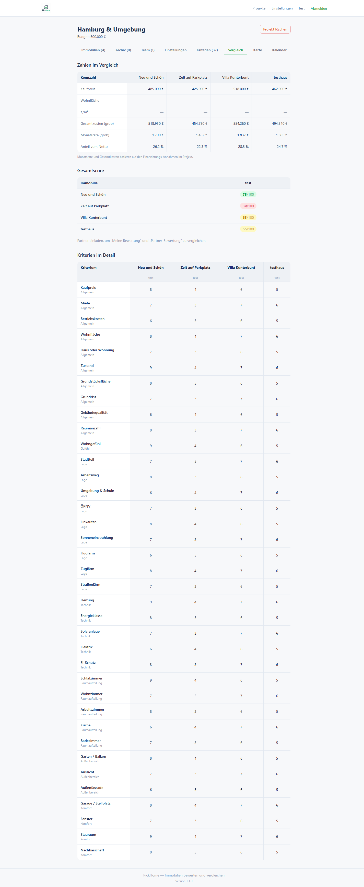 | 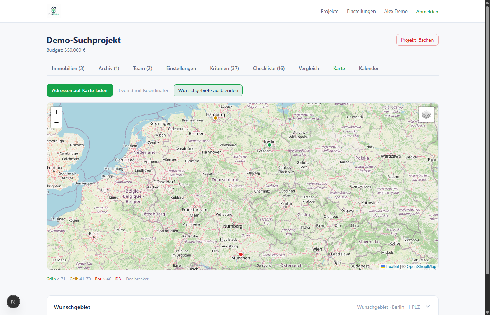 |

| Calendar | Project checklist setup |
|----------|-------------------------|
| 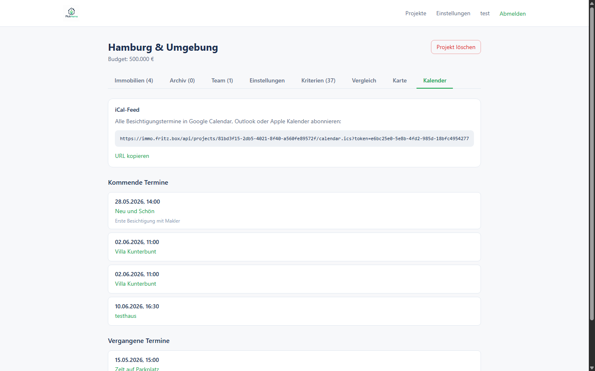 | 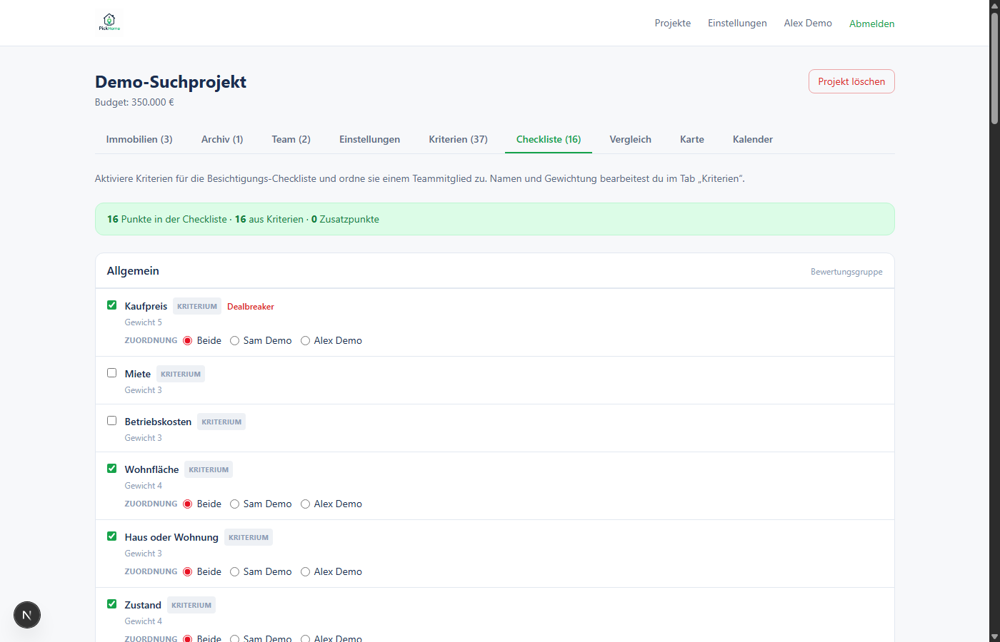 |

| Project settings (purchase costs & financing defaults) |
|--------------------------------------------------------|
| 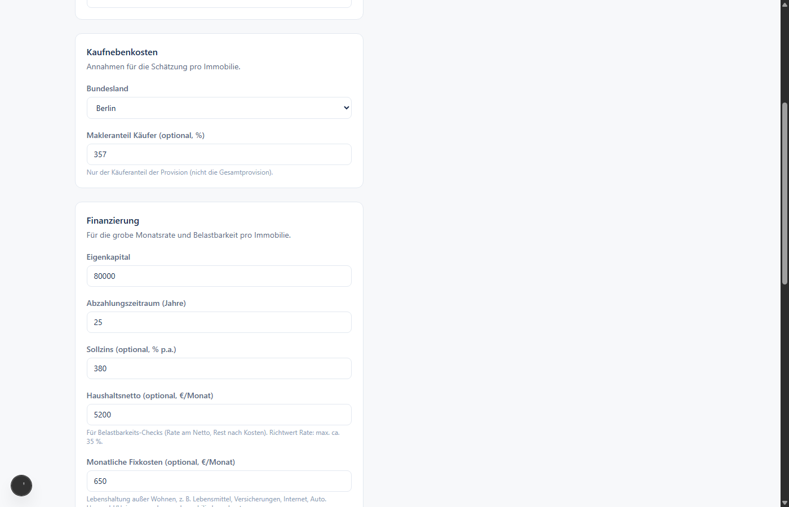 |

### Apartment detail

| Overview (toolbar, basics, costs) | Criteria rating |
|-----------------------------------|-----------------|
| 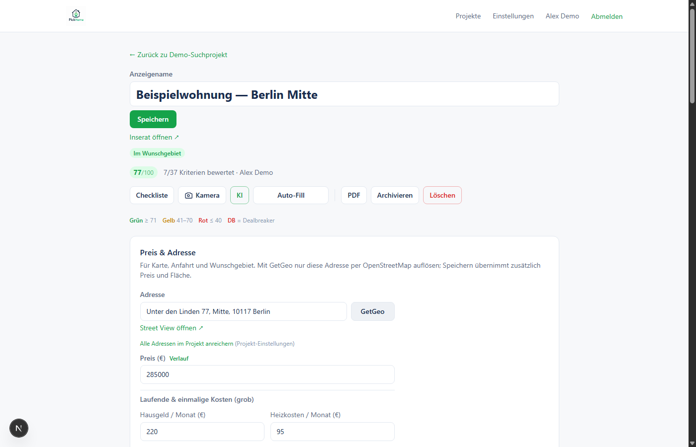 | 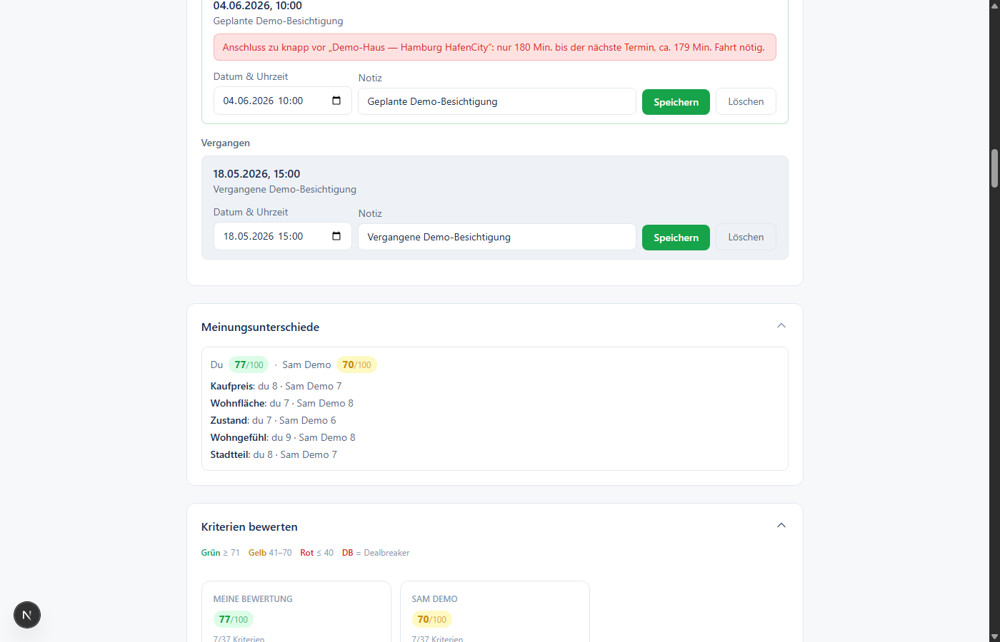 |

| On-site checklist | Commute |
|-------------------|---------|
| 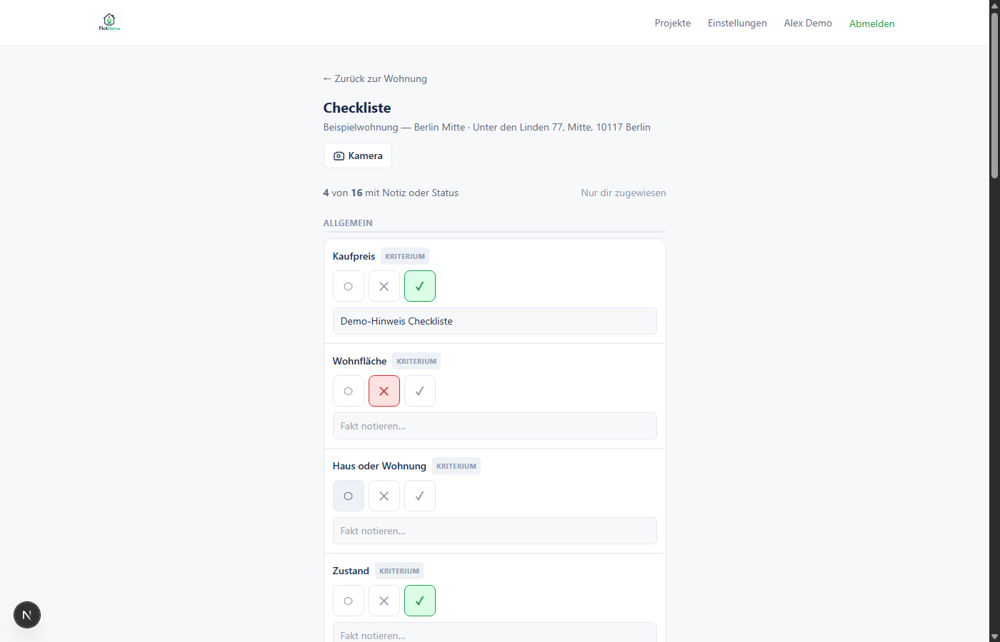 | 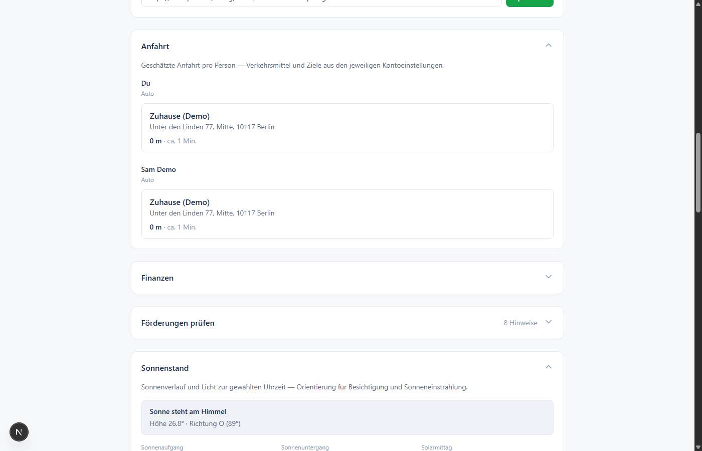 |

### Costs & land value

| Purchase & financing estimate | BORIS land value (BRW) |
|-------------------------------|-------------------------|
| 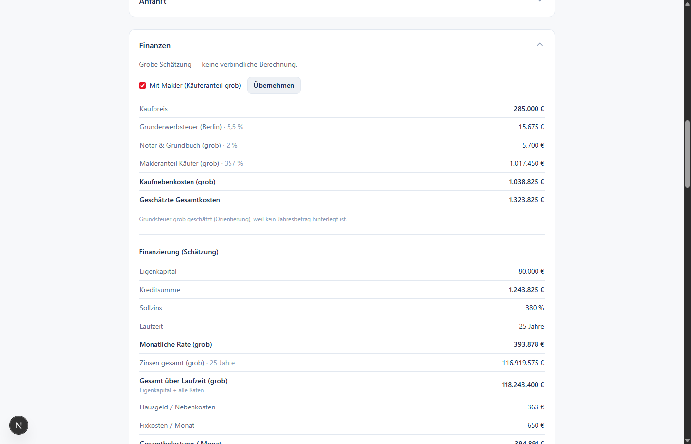 | 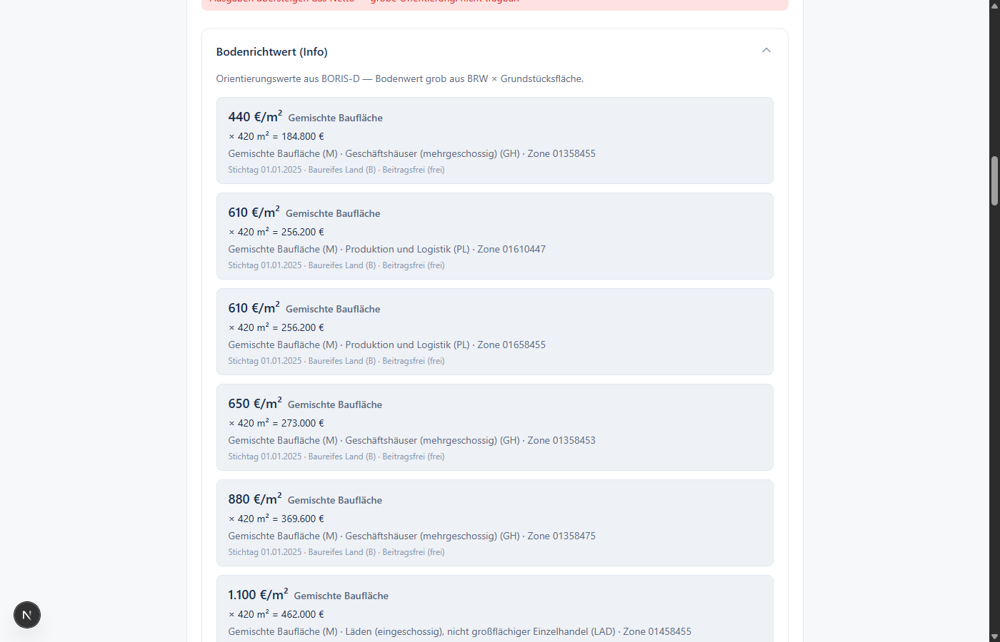 |

| Subsidy hints |
|---------------|
| 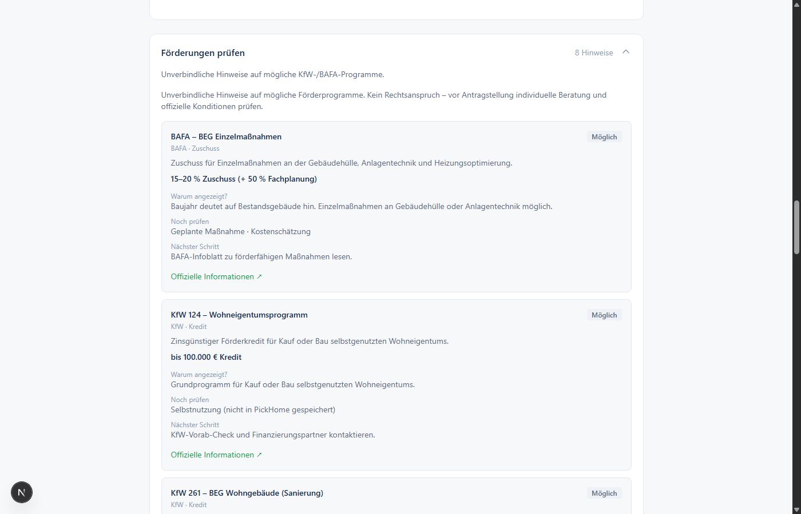 |

### Sun & AI

| Sun path & map on apartment page (Sonnenstand) | Sun AR on site (camera + compass; README uses `?demo=1` black preview) |
|-----------------------------------------------|------------------------------------------------------------------------|
| 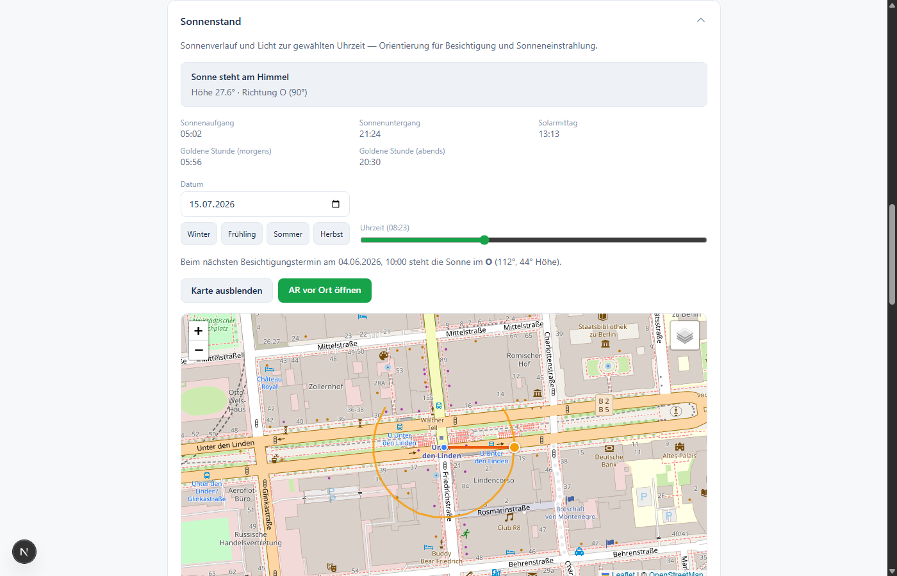 | 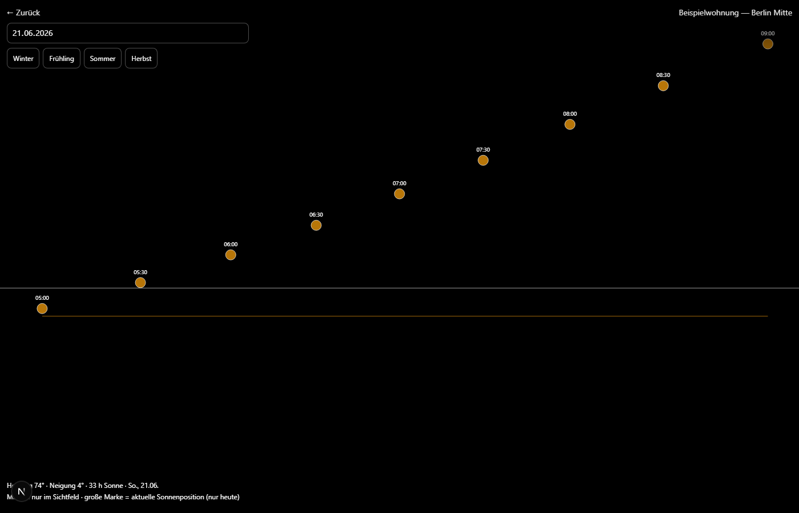 |

| AI assistant (apartment chat) |
|-------------------------------|
| 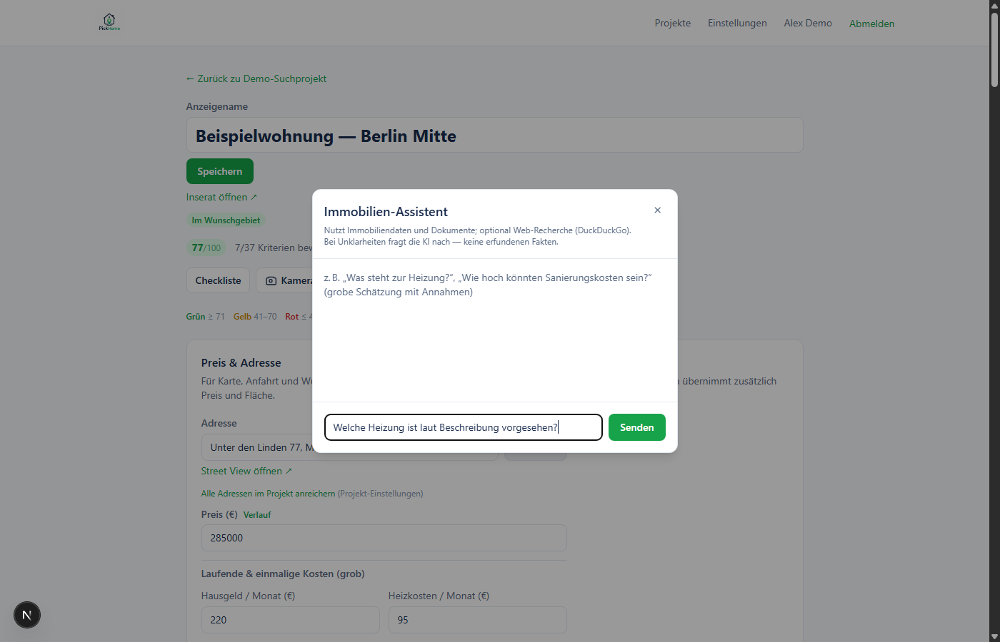 |

## Quick start (Docker)

Requirements: [Docker](https://docs.docker.com/get-docker/) with Compose.

### Pull from Docker Hub (recommended)

Image: **[`n3ro88/pickhome`](https://hub.docker.com/r/n3ro88/pickhome)**

Save as `docker-compose.yml` (or use the file from this repo):

```yaml
services:
  pickhome:
    image: n3ro88/pickhome:latest
    container_name: pickhome
    ports:
      - "127.0.0.1:${PICKHOME_PORT:-3000}:3000"
    environment:
      DATABASE_URL: "file:/app/data/pickhome.db"
      PICKHOME_DATA_DIR: "/app/data"
      NODE_ENV: production
      SESSION_SECRET: "${SESSION_SECRET:?set SESSION_SECRET in .env}"
      NEXT_PUBLIC_APP_URL: "${NEXT_PUBLIC_APP_URL:-http://localhost:3000}"
    volumes:
      - ./data:/app/data
    restart: unless-stopped
```

```bash
mkdir -p data
docker compose pull
docker compose up -d
```

From a git clone (uses the same `docker-compose.yml` in the repo):

```bash
git clone https://github.com/n3roGit/PickHome.git
cd PickHome
docker compose pull
docker compose up -d
```

Open **http://localhost:3000**

| Role | Default login |
|------|----------------|
| Administrator | `admin` / `admin` |

Change the admin password after first login (Admin → user → new password).

Optional **two-factor authentication (TOTP)** with recovery codes and password change: **Einstellungen** in the navigation (or `/account/settings`).

The production image applies **database schema updates automatically** on every container start (`scripts/db-autoupdate.mjs`).

### Data persistence

All runtime data lives in **`./data/`** (gitignored). Docker bind-mounts the same folder:

| Path | Content |
|------|---------|
| `data/pickhome.db` | SQLite database |
| `data/uploads/` | Apartment photos and documents |
| `data/backups/` | Manual and scheduled backup ZIPs |

The bundled `docker-compose.yml` sets `user: "0:0"` so the entrypoint can migrate SQLite on bind-mounted `./data`, then drops to `node` for the web app when possible. **Do not** add `user: "1000:1000"` — that skips root and breaks `db-autoupdate`.

If the container still restarts, check logs for `entrypoint uid=`. It must be `0` on start. Then fix host permissions:

```bash
sudo chown -R 1000:1000 ./data
docker compose pull
docker compose up -d
```

Ensure the volume is not read-only (`:ro`). On Synology/NAS, grant the Docker folder write access or keep `user: "0:0"`.

Stop / start:

```bash
docker compose down
docker compose up -d
```

Custom port:

```bash
PICKHOME_PORT=8080 docker compose up -d
```

### Pinned image version (recommended for production)

After a [GitHub Release](https://github.com/n3roGit/PickHome/releases), use a version tag instead of `latest`:

```yaml
image: n3ro88/pickhome:1.2.3
```

Releases: push to `main` — CI bumps the patch version in `package.json` (e.g. `1.2.0` → `1.2.1`), tags `v*`, and creates a GitHub Release. For minor/major bumps, set the first two digits in `package.json` before pushing. Update `CHANGELOG.md` manually.

### Optional: self-hosted OSRM (commute routing)

By default, commute routing uses the public OSRM demo (driving only). For reliable cycling/walking routes or higher limits, point to your own OSRM instance:

```bash
OSRM_BASE_URL=https://your-osrm.example/route/v1
# optional profile overrides: OSRM_PROFILE_FOOT, OSRM_PROFILE_BIKE, OSRM_PROFILE_DRIVING
```

### Public transit (ÖPNV) API fallback

ÖPNV commute routes use community [transport.rest](https://v6.db.transport.rest) APIs (no API key). PickHome tries providers in order:

1. Cache (SQLite commute cache)
2. `https://v6.db.transport.rest`
3. `https://v5.db.api.bahn.guru`
4. GTFS timetable routing (MOTIS) — default `https://api.transitous.org` ([GTFS Deutschland](https://gtfs.de) feeds; no public `/journeys` API on gtfs.de itself)

Override REST providers (comma-separated base URLs, no trailing slash):

```bash
TRANSIT_API_BASES=https://v6.db.transport.rest,https://v5.db.api.bahn.guru
```

GTFS/MOTIS fallback base (`off` to disable; self-host MOTIS with [gtfs.de](https://gtfs.de) downloads):

```bash
TRANSIT_GTFS_API_BASE=https://api.transitous.org
```

Background backfill stops hammering after all providers fail (120s cooldown).

## Local development (without Docker)

```bash
npm install
cp .env.example .env
npm run db:push && npm run db:seed
npm run dev
```

→ http://localhost:3000

Optional demo project for screenshots or UI previews (public addresses + fictional names/URLs):

```bash
npx tsx scripts/seed-readme-demo.ts
```

### Sun AR on mobile (HTTPS)

The apartment **AR vor Ort** view (`/project/.../apartment/.../sonne-ar`) uses the device camera, compass, and **current GPS position** for sun markers. Browsers allow this only on **HTTPS** or **localhost**. For LAN access from a phone (e.g. `http://192.168.x.x:3000`), put PickHome behind a TLS reverse proxy (Caddy, nginx, Traefik) or use `npm run dev` on the phone via USB port forwarding.

For docs/screenshots without a device camera, open the same URL with `?demo=1` (black background, fixed heading — sun arc only).

## Backup (export / import)

Move all persistent data (SQLite DB + uploads) between installations.

**Admin UI:** `/admin` → *Backup herunterladen* or upload a ZIP (then restart the container). Scheduled backups can also be restored from the admin panel.

**CLI** (with app stopped or on a copy of `data/`):

```bash
npm run data:export
# -> data/backups/pickhome-backup-<timestamp>.zip

npm run data:import -- data/backups/pickhome-backup-....zip
docker compose restart
```

Optional: `npm run data:import -- backup.zip --keep` keeps `*.pre-import-*` copies of the previous data.

Before pushing, run `npm run ci` (also runs automatically via the git pre-push hook). Stop `npm run dev` first — a running dev server can block the production build on Windows. Skip the hook in an emergency with `PICKHOME_SKIP_CI=1 git push`.

## Scripts

| Command | Description |
|---------|-------------|
| `npm run data:export` | Write full backup ZIP under `data/backups/` |
| `npm run data:import` | Restore from backup ZIP (pass path as argument) |
| `npm test` | Run unit + integration tests |
| `npm run ci` | Local CI mirror: tests + production build (same as GitHub Test workflow) |
| `npm run test:watch` | Tests in watch mode |
| `npm run dev` | Development server |
| `npm run build` | Production build |
| `npm run start` | Run production server (runs `db-autoupdate` first) |
| `npm run db:reset` | Reset DB + seed admin |
| `npm run db:push` | Apply Prisma schema |
| `npm run db:seed` | Seed admin user only |
| `npx tsx scripts/seed-readme-demo.ts` | Demo project for README screenshots (public OSM addresses) |

## Stack

- Next.js 15 (App Router)
- React 18, TypeScript
- SQLite + Prisma
- Tailwind CSS
- Leaflet (map)
- bcrypt session cookies, TOTP (`otpauth`)

## External location data (optional)

When an apartment has coordinates, PickHome can load (cached 90 days, refresh per section):

| Source | Data | Limits |
|--------|------|--------|
| [Overpass API](https://wiki.openstreetmap.org/wiki/Overpass_API) | Nearby POIs (shops, ÖPNV, schools, …) | Public rate limits; optional `OVERPASS_URL` |
| [UBA VeLa/LK](https://datahub.uba.de/server/rest/services/VeLa/LK/MapServer) | Road/rail/airport/agglomeration noise classes | Not full urban street coverage; optional `NOISE_MAP_URL` |
| [BfG INSPIRE NZ](https://geoportal.bafg.de/arcgis1/rest/services/INSPIRE/NZ/MapServer) | River flood risk zones (HWRM-RL) | No stormwater; optional `FLOOD_MAP_URL` |

All values are **orientation only**, not legal or insurance advice.

## Security notes

- Intended for **private / LAN** use. Put a reverse proxy with TLS in front if exposed to the internet.
- Default admin credentials are for first setup only — change them immediately.
- Set a strong `SESSION_SECRET` in production.
- Uploaded files are stored under `data/uploads/` (served at `/uploads/...`).

## License

This project is licensed under GPL-3.0. See [LICENSE](LICENSE).
